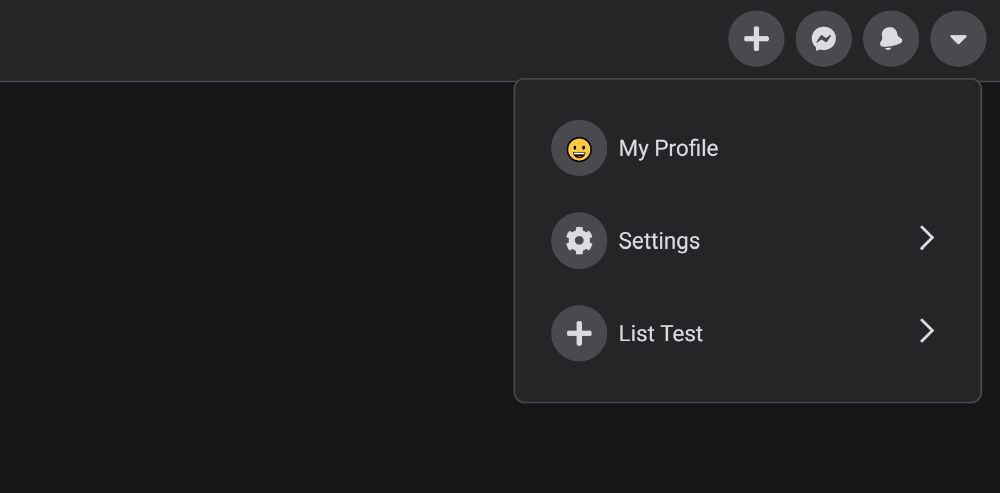

## Facebook Navbar

Screenshot

# About

As usual, I love just trying to follow along with tutorials or create what I see around the web. I find it helps keep my sharp with the languages I want to focus on and always learning.

This time I wanted to follow Fireship's Facebook Navbar tutorial: https://www.youtube.com/watch?v=IF6k0uZuypA

# Changes I made/wanted to make

First up, a slight bug that Fireship missed was his "icon-right" was not rendering. This was fixed just by adding in the CSS to make sure the SVG was filled.
Easy.

The next thing I wanted to do.... But couldn't (and would love some tips if you have any: https://twitter.com/stephenmcvicker)...
was to add a nested submenu.
I just couldn't get the sliding animations to correctly work in the right direction for going into a nested menu but aso going back to the main menu (I couldn't have 2 animations).

I love the idea of having multiple menus to drill into but this was my first time ever using the CSSTransition/react-transition-group package. I just couldn't dynamically figure out a way to have the classname correctly (didn't help using state is asyc).
Check out the link in the description to try it for yourself and go to list > nested list and see if you can have a solution to correctly have the list slide left on the nested click, but correctly slide back to the right when going back to the main menu.
